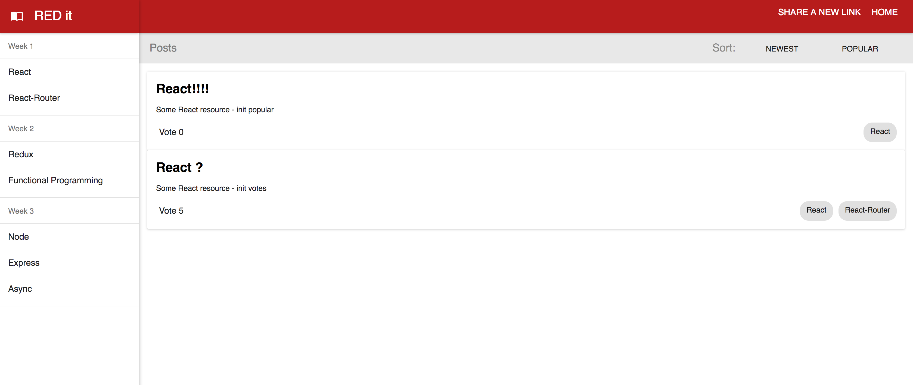

# RED it

The purpose of this project was to make a full-stack JavaScript component based web application, 
using  with React and Redux as client side technologies connecting to a REST api served through 
Express to a persistance layer of a PostgreSQL database.

This project was designed to mimic a reddit topic posting application.

## Technologies Used
- Javascript
- React
- Redux
- Express
- REST api
- PostgreSQL
- Dev tools (Webpack, ESLint, Babel)

## Personal Learnings
The development of this project allowed me to explore React and Redux as development 
libraries for building client-side component-based single page applications.

I also learned how to set up an express server and construct REST end points and build 
a PostgreSQL database.

In addition I also learned how to initiate and setup a project development environment 
using tools such as Webpack, JavaScript linters and babel transpilers.

## ⚛️ Installation

#### Install
- Clone or download this repository
- Run `yarn` in the `server` & `web.browser` directories

#### Development
- Run `npm start` from the `web.browser` directory

#### Express server
- Run `npm run build` from the `web.browser` directory
- Run `npm run start:debug` from the `server` directory
